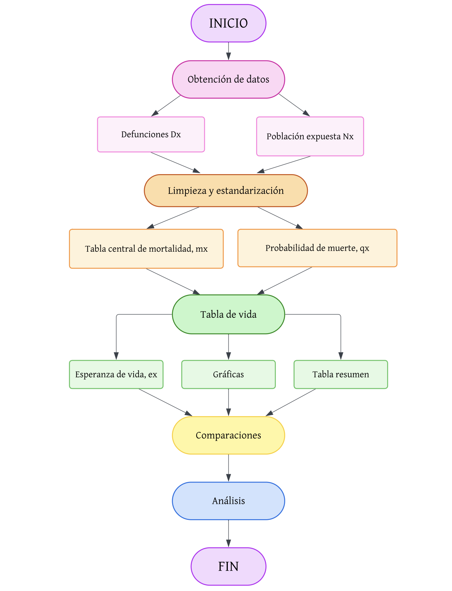

### Nota importante:
Se mencionan los pasos para poder correr el código por primera vez.

# Análisis Demográfico del Estado de Guerrero
 
**Autores:** Iván Aguilar Celis y Ana Paola Rivera Gallardo  
**Materia:** Demografía 9219  
**Institución:** Facultad de Ciencias, UNAM  
 
---
 
<p align="center">
  
</p>

---

## Descripción
 
Este proyecto realiza un análisis demográfico integral del estado de
Guerrero para los años 2010, 2019 y 2021, abarcando mortalidad,
fecundidad y estimación indirecta de mortalidad infantil.
 
Guerrero es un caso singular en México: ocupa el **primer lugar nacional
en marginación** y ha sido consistentemente una de las
entidades más violentas del país. Estos factores estructurales, combinados
con el impacto del COVID-19 en 2021, configuran un perfil demográfico
que este proyecto documenta con herramientas formales.
 
---
 
## Diagrama de flujo metodológico
 
<p align="center">
  
</p>

---
 
## Estructura del proyecto
 
```
Proyecto_Final_9219.qmd
│
├── PORTADA                          LaTeX — logos, mapa, título, autores
├── ÍNDICE                           Generado automáticamente por Quarto
│
├── ## a) Introducción               Contexto y objetivos del análisis
├── ## Contexto de Guerrero          Violencia y marginación como determinantes
│   ├── Indicador 1 — Homicidios
│   └── Indicador 2 — Marginación
│
├── ## b) Diagrama de flujo          Proceso metodológico (imagen)
│   └── data/diagrama_flujo_tablas_vida.png
│
├── ## c) Fórmulas utilizadas        Definición matemática de cada indicador
│   ├── Crecimiento exponencial
│   ├── Tasa central de mortalidad mx
│   ├── Probabilidad de muerte qx
│   └── Esperanza de vida ex
│
├── ## Lecturas — Kenneth W. Wachter Resumen conceptual de demografía formal
│
├── [Chunk de carga de datos]        CONAPO + WPP2024
│   ├── data/00_Pob_Mitad_1950_2070.csv
│   ├── data/WPP2024_deaths_m.xlsx
│   ├── data/WPP2024_deaths_f.xlsx
│   ├── data/WPP2024_population_m.xlsx
│   └── data/WPP2024_population_f.xlsx
│
├── ### Pirámides poblacionales      Guerrero 1970, 2010, 2019, 2021
│   └── [gráfica ggplot2 — barras horizontales por edad y sexo]
│
├── ## Lectura de muertes ARG/GUA    Ejercicio con datos internacionales
│   └── [tabla kable] — data/Mx_ARG_GUA.csv
│
├── ## Lectura de muertes Guerrero   Defunciones INEGI 2010/2019/2021
│   └── [tabla kable] — data/INEGI(Defunciones Guerrero).xlsx
│
├── ## Escritura de funciones        Función weight_mean() auxiliar
│
├── ## Crecimiento exponencial MX    [gráfica ggplot2] — proyección 2020–2100
├── ## Crecimiento exponencial GRO   [gráfica ggplot2] — proyección 2020–2100
│
├── ## Tasas brutas y específicas
│   ├── Argentina (ejercicio)        [gráfica ggplot2] — log(mx) año 2018
│   ├── [Limpieza defunciones INEGI] Los nombres INEGI→CONAPO se estandarizan
│   ├── [Población mitad de año]     N(t+0.5) = N(t)·exp(0.5·r)
│   ├── [Cálculo de mx]              join defunciones + población
│   ├── Tasas brutas Guerrero        [tabla kable] — por año y sexo
│   ├── log(mx) Guerrero 2010        [gráfica ggplot2] — facet H/M, azul
│   ├── log(mx) Guerrero 2019        [gráfica ggplot2] — facet H/M, verde
│   ├── log(mx) Guerrero 2021        [gráfica ggplot2] — facet H/M, rojo
│   └── log(mx) comparativo          [gráfica ggplot2] — 3 años superpuestos
│
├── ## Comparativa Guerrero/Noruega  [gráfica ggplot2] — log(mx) por edad
│
├── ## Tablas de vida
│   ├── Función tabla_vida()         Construcción con Coale-Demeny
│   ├── 6 tablas de vida             H y M × 2010, 2019, 2021 [kable]
│   ├── ## e) Cuadro e₀              [tabla kable] — resumen por año y sexo
│   └── ## f) Gráficas adicionales
│       ├── lx — curva de supervivencia        [gráfica ggplot2]
│       ├── dx — distribución de muertes       [gráfica ggplot2]
│       ├── qx — probabilidad de muerte        [gráfica ggplot2]
│       ├── px — probabilidad de sobrevivir    [gráfica ggplot2]
│       ├── Lx — años-persona en intervalo     [gráfica ggplot2]
│       ├── Tx — años-persona acumulados       [gráfica ggplot2]
│       ├── ex — esperanza de vida por edad    [gráfica ggplot2]
│       └── e₀ — evolución temporal            [gráfica ggplot2]
│
├── ## Fecundidad — México y Guerrero
│   ├── ### TEF México (WPP 2024)
│   │   ├── TEF años seleccionados   [gráfica ggplot2]
│   │   ├── TGF histórica 1970–2024  [gráfica ggplot2]
│   │   └── EMF histórica 1970–2024  [gráfica ggplot2]
│   ├── ### TEF Guerrero (INEGI)
│   │   ├── TEF por año              [gráfica ggplot2]
│   │   └── Tabla TGF y EMF          [tabla kable]
│   └── ### Comparativa México vs Guerrero
│       ├── TGF comparativa          [gráfica ggplot2]
│       ├── EMF comparativa          [gráfica ggplot2]
│       └── TEF por grupo 2019       [gráfica ggplot2]
│
├── ## Estimación indirecta — Método Brass (CPV 2020)
│   ├── Tabla q(x) con D(i), k(i)   [tabla kable]
│   ├── Evolución q(x)               [gráfica ggplot2]
│   └── D(i) por grupo de edad       [gráfica ggplot2]
│
├── ## g) Análisis y conclusión
│   ├── Tendencia pre-pandemia (2010–2019)
│   ├── Impacto COVID-19 en 2021
│   ├── Fecundidad: transición acelerada
│   ├── Mortalidad infantil — Método Brass
│   └── Conclusión
│
└── ## Referencias
```
 
---
 
## Estructura del repositorio
 
```
Demography_9219_Final_Project/
├── Proyecto_Final_9219.qmd              # Documento fuente en Quarto
├── Proyecto_Final_9219.pdf              # Informe final renderizado
├── README.md
├── data/
│   ├── 00_Pob_Mitad_1950_2070.csv            # Proyecciones CONAPO
│   ├── Diagrama_de_flujo.png                  # Diagrama de flujo
│   ├── FC-Logo.png                            # Logo FC (ver nota abajo)
│   ├── FC-Logo.webp                           # Logo FC original
│   ├── Fecundidad_Nacional.xlsx               # Fecundidad Nacional INEGI
│   ├── Foto de Guerrero.jpg                   # Mapa para portada
│   ├── INEGI_defunciones_homicidio.xls        # Defunciones por homicidio
│   ├── INEGI_exporta_N...tos_Guerrero.xls     # Nacimientos Guerrero INEGI
│   ├── INEGI_Guerrero_2010.xls                # Datos INEGI Guerrero 2010
│   ├── INEGI_Guerrero_2020.xls                # Datos INEGI Guerrero 2020
│   ├── INEGI(Defunciones Guerrero).xls        # Defunciones SINAIS/INEGI (.xls)
│   ├── INEGI(Defunciones Guerrero).xlsx       # Defunciones SINAIS/INEGI (.xlsx)
│   ├── INEGI(Población Guerrero 2020).xls     # Población Guerrero 2020
│   ├── INEGI(Población Guerrero).xls          # Población Guerrero INEGI
│   ├── Mortalidad_Nacional.xlsx               # Mortalidad Nacional INEGI
│   ├── Mx_ARG_GUA.csv                         # Tasas Argentina y Guatemala
│   ├── UNAM-Logo.png                          # Logo UNAM
│   ├── WPP2024_ASFR_by_Age5.xlsx             # TEF por grupo quinquenal ONU
│   ├── WPP2024_deaths_f.xlsx                  # Muertes ONU — mujeres
│   ├── WPP2024_deaths_m.xlsx                  # Muertes ONU — hombres
│   ├── WPP2024_population_f.xlsx              # Población ONU — mujeres
│   └── WPP2024_population_m.xlsx              # Población ONU — hombres
└── Output/
    ├── Diagrama_de_Lexis_Guerrero.xlsx        # Diagrama de Lexis
    ├── LT_CausaEliminada_Guerrero_2019.xlsx   # Tabla vida causa eliminada 2019
    ├── LT_CausaEliminada_Guerrero_2020.xlsx   # Tabla vida causa eliminada 2020
    ├── ProyectoFinal_AguilarRivera.xlsx        # Excel proyecto final
    ├── ProyectoFinal_av...guilarRivera.xlsx    # Excel proyecto final (alt)
    └── TGF_TBR_TNR_Guerrero_2010_2019.xlsx   # TGF, TBR y TNR Guerrero

> **Nota sobre FC-Logo:** el logo original está en `.webp`, que LaTeX no soporta.
> Conviértelo a PNG una sola vez antes de renderizar:
> ```bash
> # Mac:
> sips -s format png data/FC-Logo.webp --out data/FC-Logo.png
> # Linux:
> convert data/FC-Logo.webp data/FC-Logo.png
> # Windows:
> magick data/FC-Logo.webp data/FC-Logo.png
> ```
 
---
 
## Resultados principales
 
### Esperanza de vida al nacer — Guerrero
 
| Año  | e₀ Hombres | e₀ Mujeres | Diferencia H vs M |
|------|:----------:|:----------:|:-----------------:|
| 2010 | 73.32      | 80.25      | -6.93             |
| 2019 | 74.30      | 81.40      | -7.10             |
| 2021 | **68.66**  | **76.53**  | -7.87             |
 
> **Guerrero perdió 5.6 años de esperanza de vida masculina en un solo año.**
 
### Fecundidad — Guerrero
 
| Año  | TGF (hijos/mujer) | EMF (años) |
|------|:-----------------:|:----------:|
| 2010 | ~3.68              | ~26.5      |
| 2019 | ~2.35              | ~27.2      |
| 2021 | ~2.08              | ~27.5      |
 
### Mortalidad infantil estimada — Método Brass
 
| Indicador | q(x) | Año referencia |
|-----------|:----:|:--------------:|
| q(1)      | 21.6 por 1,000 | ~2019 |
| q(3)      | 25.2 por 1,000 | ~2016 |
| q(5)      | 29.6 por 1,000 | ~2014 |
 
---
 
## Cómo reproducir — instrucciones completas
 
### Paso 1 — Instalar R y RStudio
 
- **R** (>= 4.2): https://cran.r-project.org
- **RStudio**: https://posit.co/download/rstudio-desktop
### Paso 2 — Instalar Quarto
 
Quarto viene incluido en versiones recientes de RStudio. Si no lo tienes:
https://quarto.org/docs/get-started
 
### Paso 3 — Instalar paquetes de R
 
```r
install.packages(c(
  "tidyverse", "data.table", "readxl", "kableExtra",
  "lubridate", "mipfp", "openxlsx2", "rstan"
))
 
install.packages("remotes")
remotes::install_github("timriffe/DemoTools")
```
 
> **Windows:** `rstan` requiere [Rtools](https://cran.r-project.org/bin/windows/Rtools/).
>
> **Mac:** si falla `rstan`:
> ```r
> install.packages("StanHeaders")
> install.packages("rstan", type = "source")
> ```
 
### Paso 4 — Instalar LaTeX
 
```r
install.packages("tinytex")
tinytex::install_tinytex()
```
 
### Paso 5 — Convertir logo (solo la primera vez)
 
```bash
sips -s format png data/FC-Logo.webp --out data/FC-Logo.png
```
 
### Paso 6 — Renderizar
 
```bash
quarto render Proyecto_Final_9219.qmd
```
 
---
 
## Fuentes de datos
 
| Dato | Fuente | Incluido |
|------|--------|:--------:|
| Defunciones Guerrero 1990–2024 | SINAIS/INEGI | ✓ |
| Muertes internacionales | UN WPP 2024 | ✓ |
| Población internacional | UN WPP 2024 | ✓ |
| TEF por grupo quinquenal | UN WPP 2024 | ✓ |
| Fecundidad Censo 2020 | INEGI CPV 2020 | ✓ |
| Mortalidad Censo 2020 | INEGI CPV 2020 | ✓ |
| Tasas ARG y GUA | Ejercicio de clase | ✓ |
 
---
 
## Notas metodológicas
 
- **Población expuesta:** $N(t+0.5) = N(t) \cdot e^{0.5r}$, $r = \ln(N_{t+1}/N_t)$
- **Convenciones $a_x$:** Coale-Demeny — $a_0$ depende de $m_0$; $a_{1-4}=1.5$; quinquenales $a_x=2.5$
- **Grupo abierto:** $L_{85+} = l_{85+}/m_{85+}$
- **Método Brass:** multiplicadores Princeton-West (Trussell 1975), variante edad de la madre

---
 
## Referencias
 
- Instituto Nacional de Estadística y Geografía (INEGI). (2010, 2019, 2021). *Estadísticas de defunciones registradas (EDR)*. Sistema Nacional de Información en Salud (SINAIS). Recuperado de https://www.inegi.org.mx/sistemas/olap/proyectos/bd/continuas/mortalidad/defunciones.asp

- United Nations, Department of Economic and Social Affairs, Population Division. (2024). *World Population Prospects 2024: Deaths by single age and sex, medium variant, 1950-2023*. Recuperado de https://population.un.org/wpp/

- United Nations, Department of Economic and Social Affairs, Population Division. (2024). *World Population Prospects 2024: Population by single age and sex, medium variant, 1950-2023*. Recuperado de https://population.un.org/wpp/

- Secretariado Ejecutivo del Sistema Nacional de Seguridad Pública (SESNSP). (2022). *Incidencia delictiva del fuero común: homicidio doloso 2011-2021*. Recuperado de https://www.gob.mx/sesnsp/acciones-y-programas/datos-abiertos-de-incidencia-delictiva

- Wachter, K. W. (2014). Essential Demographic Methods. Harvard University Press.
